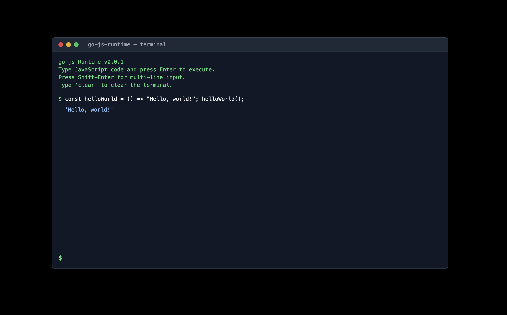

# go-js

A toy JavaScript engine written in Go. This project is a learning exercise to both learn Go and better understand how JavaScript works under the hood.

## Demo

An interactive runtime REPL is available at [zbrannelly.dev/go-js](https://zbrannelly.dev/go-js), compiled to WebAssembly.



## Usage

```bash
./go-js
```

You can test out stages of the engine using the `repl` command:

```bash
# Lexer
./go-js repl --mode=lexer

# Parser (AST)
./go-js repl --mode=parser

# Evaluation
./go-js repl
```

Or run evaluation on a JavaScript file using the `run` command:

```bash
./go-js run path/to/script.js
```

## Roadmap

The project is in very early stages. Currently implementing:

- [x] Lexical Analysis
- [x] Syntax Analysis
- [ ] Semantic Analysis
- [ ] Naive Evaluation
- [ ] Run [Test262](https://github.com/tc39/test262) Test Suite
- [ ] Intermediate Code Generation
- [ ] Code Optimization
- [ ] Code Generation
